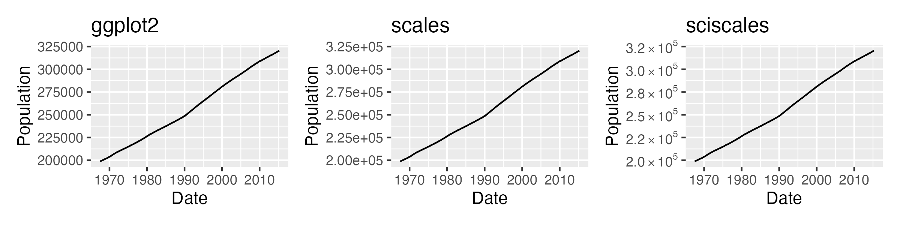
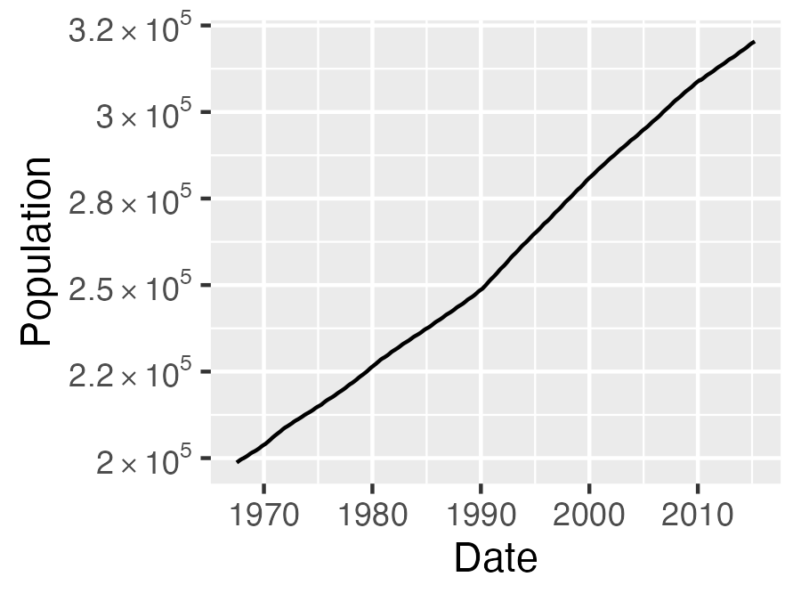

<!-- README.md is generated from README.Rmd. Please edit that file -->

# sciscales

<!-- badges: start -->
<!-- badges: end -->

The `sciscales` package provides convenient functions to convert
`ggplot2` axis labels, annotations, legend labels, etc. into formatted
scientific notation. The output format is flexible, with several options
included to allow customization of the formatted numbers.

## Installation

You can install the development version of `sciscales` from
[GitHub](https://github.com/) with:

``` r
# install.packages("devtools")
devtools::install_github("christyray/sciscales")
```

## Examples

`ggplot2`’s default formatting for large numbers is to print them
plainly with no formatting, which can be hard to read or unsightly for
very large numbers.

The `scales` package includes the `label_scientific()` function, which
formats large numbers in the `e+00` notation. This can be much clearer
than plain numbers, but may not be the desired formatting for a polished
figure.

The `sciscales` package includes the `label_sci()` function to convert
large numbers into formatted scientific notation. The `label_sci()`
function can be passed to the `labels` argument of a `scale_*()`
function to auto-format the label numbers.

``` r
library(ggplot2)
library(scales)
library(sciscales)
library(patchwork)

p <- ggplot(economics, aes(x = date, y = pop)) +
  geom_line() +
  labs(x = "Date", y = "Population")

p_ggplot <- p + ggtitle("ggplot2")
p_scales <- p + scale_y_continuous(labels = label_scientific()) + ggtitle("scales")
p_sciscales <- p + scale_y_continuous(labels = label_sci()) + ggtitle("sciscales")

p_ggplot + p_scales + p_sciscales
```



Additional arguments to `label_sci()` allow more control over the
appearance of the formatted numbers, such as whether to include trailing
zeros:

``` r
p + scale_y_continuous(labels = label_sci(trailing = FALSE))
```


